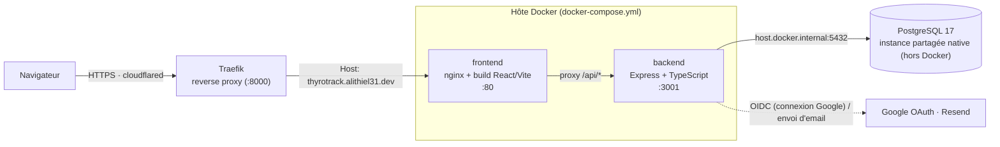

# 🦋 ThyroTrack

[](https://github.com/Alithiel31/ThyFollow/actions/workflows/ci.yml)

Application web de suivi thyroïdien, inspirée de l'app Clue.  
**Stack** : TypeScript · Express · Prisma · PostgreSQL · React · Recharts · Docker

## Table des matières

- [Fonctionnalités](#fonctionnalités)
- [Architecture](#architecture)
- [Démarrage rapide (local)](#démarrage-rapide-local)
- [Déploiement](#déploiement-docker-compose-self-hosted)
- [Structure du projet](#structure-du-projet)
- [Schéma de la base de données](#schéma-de-la-base-de-données)
- [API Endpoints](#api-endpoints)
- [Design System](#design-system)
- [Stack technique](#stack-technique)
- [Contribuer](#contribuer)
- [Changelog](#changelog)
- [Licence](#licence)

---

## ✨ Fonctionnalités

| Module | Détail |
|---|---|
| **Journal quotidien** | Énergie, humeur, anxiété, brouillard mental, 11 symptômes thyroïdiens, médicament pris, mesures physiques (poids/FC/sommeil synchronisables via Google Health, ex: Pixel Watch) |
| **Analyses sanguines** | TSH, FT4, FT3, Anti-TPO, Anti-TG, carences (Ferritine, Vit D, B12…) avec graphiques d'évolution |
| **Médicaments** | Gestion du traitement (Levothyrox, etc.), dosage, fréquence, observance |
| **Rendez-vous** | Agenda médical avec rappels, statuts, types spécialisés |
| **Tableau de bord** | Streak médicament, observance, moyennes, prochain RDV, historique TSH |
| **Profil** | Diagnostic, état thyroïde, plages TSH/FT4/FT3 personnalisées par votre médecin |

---

## 🏗️ Architecture



Le conteneur `frontend` ne sert que des fichiers statiques (nginx) ; toutes les requêtes
`/api/*` sont proxyfiées vers `backend` (voir `frontend/nginx.conf`), qui est seul à parler à
PostgreSQL via Prisma. Le navigateur ne voit donc qu'une seule origine, ce qui évite toute
configuration CORS côté client en production — `CORS_ORIGIN`/`FRONTEND_URL` restent un garde-fou
si le backend est appelé directement.

Aucun port n'est publié sur l'hôte : `frontend` est joint au réseau `traefik-net` (créé par
Traefik, déclaré `external: true` dans `docker-compose.yml`) et porte des labels
`traefik.*` qui routent `thyrotrack.alithiel31.dev` vers son port interne `80`. Traefik est un
service partagé entre plusieurs projets sur cet hôte, pas géré par ce repo. PostgreSQL n'est pas
non plus un service de ce `docker-compose.yml` : c'est une instance partagée, elle aussi commune
à plusieurs projets sur cet hôte, jointe depuis le conteneur `backend` via
`host.docker.internal` (voir `extra_hosts` dans `docker-compose.yml`).

---

## 🚀 Démarrage rapide (local)

### Prérequis
- Node.js 20+
- PostgreSQL (ou Docker)

### 1. Cloner et installer
```bash
git clone <url>
cd thyro-track
cd backend && npm install && cd ..
cd frontend && npm install && cd ..
```

### 2. Configurer l'environnement backend
```bash
cp backend/.env.example backend/.env
# Éditer backend/.env avec votre DATABASE_URL et JWT_SECRET
```

#### (Optionnel) Activer "Se connecter avec Google"

Sans `GOOGLE_CLIENT_ID`/`GOOGLE_CLIENT_SECRET`, `GET /api/auth/oidc/google` répond simplement `501` et le bouton Google reste inutile — le reste de l'app fonctionne normalement. Pour l'activer :

1. Sur [Google Cloud Console](https://console.cloud.google.com/), créez (ou sélectionnez) un projet.
2. **APIs & Services → OAuth consent screen** : type *External*, renseignez le nom de l'app et un email de support, ajoutez les scopes `openid`, `email`, `profile`.
3. **APIs & Services → Credentials → Create Credentials → OAuth client ID**, type *Web application*.
4. **Authorized JavaScript origins** : `http://localhost:5173` (URL du frontend).
5. **Authorized redirect URIs** : `http://localhost:3001/api/auth/oidc/google/callback` (doit correspondre exactement à `GOOGLE_REDIRECT_URI`, c'est l'URL du **backend**, pas du frontend).
6. Copiez le *Client ID* et le *Client Secret* générés dans `backend/.env` :
   ```bash
   GOOGLE_CLIENT_ID="xxxxxxxx.apps.googleusercontent.com"
   GOOGLE_CLIENT_SECRET="xxxxxxxx"
   ```
En production, mettez à jour les origines/redirect URIs avec le domaine réel et ajustez `GOOGLE_REDIRECT_URI` (+ `APP_URL`) en conséquence.

#### (Optionnel) Synchroniser Google Health (poids / rythme cardiaque / sommeil)

Fonctionnalité distincte de "Se connecter avec Google" ci-dessus : elle relie un appareil
connecté (ex: **Pixel Watch**) via la [Google Health API](https://developers.google.com/health)
pour pré-remplir automatiquement Poids, Rythme cardiaque et Heures de sommeil dans le Journal
(un badge <kbd>⌚</kbd> indique une valeur synchronisée). Sans `GOOGLE_HEALTH_CLIENT_ID`, la carte
"Google Health" du Profil répond `501` et reste inactive.

Deux flux d'authentification distincts sont en jeu :
- **OAuth utilisateur** (`GOOGLE_HEALTH_CLIENT_ID`/`SECRET`) : chaque utilisateur autorise
  ThyroTrack à lire ses données santé — c'est le bouton "Lier" du Profil.
- **Compte de service IAM Google Cloud** (`GOOGLE_HEALTH_SERVICE_ACCOUNT_KEY`) : gère un
  **unique abonné webhook au niveau du projet** (pas par utilisateur), créé une fois au démarrage
  du backend. Avec une politique `AUTOMATIC`, Google route ensuite automatiquement les
  notifications de tout utilisateur consentant vers cet abonné — aucun abonnement individuel
  n'est nécessaire.

> ⚠️ **`fetchDailyMetrics` (lecture des mesures) reste partiellement une best-effort.** Le host,
> la version (`health.googleapis.com/v4`), les scopes OAuth et tout le modèle d'abonnement webhook
> ont été confirmés par lecture directe de la documentation officielle. En revanche, la forme
> exacte du corps JSON renvoyé par les endpoints `dataTypes/{type}/dataPoints` (utilisés pour
> lire les valeurs) n'a pas pu être vérifiée — le parsing dans
> `backend/src/lib/googleHealth.ts#fetchDailyMetrics` est une meilleure hypothèse, à ajuster si
> besoin une fois des données réelles observées.

**1. Projet et API**

Sur [Google Cloud Console](https://console.cloud.google.com/), activez la **Google Health API**
sur le projet (le même que "Se connecter avec Google" ou un projet dédié). Notez le **numéro**
du projet (visible sur la page d'accueil du projet — pas son ID textuel, Google renvoie une
erreur 400/403 sinon) pour `GOOGLE_HEALTH_PROJECT_NUMBER`.

**2. Client OAuth (connexion utilisateur)**

1. **APIs & Services → Credentials → Create Credentials → OAuth client ID**, type *Web
   application* — des credentials séparées de celles du login, car les scopes santé sont
   sensibles.
2. **Authorized redirect URIs** : `http://localhost:3001/api/integrations/google-health/callback`
   (doit correspondre à `GOOGLE_HEALTH_REDIRECT_URI`).
3. Copiez le *Client ID*/*Client Secret* dans `backend/.env` (`GOOGLE_HEALTH_CLIENT_ID`,
   `GOOGLE_HEALTH_CLIENT_SECRET`), et générez une clé de chiffrement pour les tokens stockés :
   ```bash
   node -e "console.log(require('crypto').randomBytes(32).toString('hex'))"
   ```
   à mettre dans `TOKEN_ENCRYPTION_KEY` (requise dès que `GOOGLE_HEALTH_CLIENT_ID` est renseigné,
   le serveur refuse de démarrer en production sinon).
4. Ajoutez votre compte Google comme **testeur** : **Google Auth Platform → Audience → Utilisateurs
   tests → Add users** (nécessaire tant que l'app n'est pas publiée/vérifiée par Google — largement
   suffisant pour un usage personnel).

**3. Compte de service (abonné webhook au niveau du projet)**

1. **IAM et administration → Comptes de service → Créer un compte de service.**
2. Attribuez-lui le rôle **"Éditeur de l'API Google Health"** (ou Administrateur, selon vos
   besoins).
3. Générez une clé JSON pour ce compte de service (onglet **Clés → Ajouter une clé → JSON**) et
   collez **le contenu complet du fichier téléchargé** dans `GOOGLE_HEALTH_SERVICE_ACCOUNT_KEY`
   (pas un chemin de fichier — la variable d'env porte le JSON lui-même).
4. Choisissez un secret et mettez-le dans `GOOGLE_HEALTH_WEBHOOK_SECRET` :
   ```bash
   node -e "console.log('Bearer ' + require('crypto').randomBytes(24).toString('hex'))"
   ```
   Ce secret est envoyé à Google à la création de l'abonné et renvoyé tel quel par Google dans
   chaque notification — c'est ce qui permet au backend de vérifier leur authenticité.
5. Renseignez `GOOGLE_HEALTH_PROJECT_NUMBER` (voir étape 1).

**4. Important : HTTPS public**

`POST /api/webhooks/google-health` doit être joignable par Google en HTTPS public — ça ne
fonctionnera pas avec `localhost`. Un vrai domaine déployé est nécessaire pour que l'abonné
se crée avec succès : Google effectue une double vérification synchrone de l'endpoint (une
requête authentifiée qui doit répondre 200/201, une non authentifiée qui doit répondre
401/403) au moment de la création, et **la création de l'abonné échoue si l'une des deux rate.**

Une fois tout renseigné, redémarrez le backend : il crée l'abonné automatiquement au démarrage
(voir les logs pour confirmer `Abonné webhook Google Health "thyrotrack-webhook" créé.`).

En production, mettez à jour `GOOGLE_HEALTH_REDIRECT_URI` avec le domaine réel.

### 3. Initialiser la base de données
```bash
cd backend
npx prisma migrate dev --name init
npx prisma generate
npm run db:seed   # Crée un compte démo: demo@thyrotrack.com / demo1234
```

### 4. Lancer en développement

Dans deux terminaux séparés :
```bash
cd backend && npm run dev   # http://localhost:3001
```
```bash
cd frontend && npm run dev  # http://localhost:5173
```

---

## 🐳 Déploiement (Docker Compose, self-hosted)

Le déploiement réel de ce projet passe par `docker-compose.yml` à la racine : deux services
(backend Express, frontend servi par nginx) construits depuis `backend/Dockerfile` et
`frontend/Dockerfile`. Depuis le 2026-08-22, PostgreSQL n'est **plus** un service de ce fichier —
le backend se connecte à une instance PostgreSQL partagée avec d'autres projets sur le même hôte,
et le frontend n'expose plus de port : il est routé via un reverse proxy Traefik partagé lui
aussi (voir le diagramme d'architecture ci-dessus). Ces deux dépendances externes sont donc
préalables à tout déploiement avec ce fichier tel quel :

- une instance PostgreSQL joignable en réseau, avec une base et un rôle applicatif déjà créés ;
- une instance Traefik (provider Docker, réseau `traefik-net`) déjà en place sur l'hôte.

> **Déploiement sur un hôte sans Traefik ni PostgreSQL partagé** (ex: un nouvel hôte, ou un test
> isolé) : ce `docker-compose.yml` n'est plus autonome tel quel. Il faudrait soit réintroduire un
> service `postgres` dédié et republier un port sur `frontend` (`ports: ["8082:80"]`, en retirant
> les labels `traefik.*` et le réseau `traefik-net`), soit déployer sa propre instance Traefik.
> Ce n'est pas documenté ici car ce n'est pas la configuration réellement utilisée pour ce
> projet — demander si besoin.

### 1. Configurer l'environnement
```bash
cp .env.example .env
# Renseigner DB_PASSWORD : le mot de passe du rôle applicatif PostgreSQL
# (ex: openssl rand -hex 24), déjà créé sur l'instance partagée.

cp backend/.env.example backend/.env
# Renseigner JWT_SECRET (32+ caractères), RESEND_API_KEY, et
# GOOGLE_CLIENT_ID/GOOGLE_CLIENT_SECRET si "Se connecter avec Google" est utilisé.
# DATABASE_URL et FRONTEND_URL sont déjà fixés dans docker-compose.yml —
# adaptez-y votre propre domaine et votre hôte PostgreSQL avant de déployer.
```

### 2. Lancer
```bash
docker compose up -d --build
```
Le conteneur backend exécute automatiquement `prisma migrate deploy` au démarrage (voir
`backend/Dockerfile`) et rejoint PostgreSQL via `host.docker.internal` (voir `extra_hosts` dans
`docker-compose.yml`) — la base doit donc déjà exister avec le rôle applicatif attendu par
`DATABASE_URL`. Le frontend est routé par Traefik d'après ses labels `traefik.*` (règle `Host`
sur le domaine configuré), le backend reste en interne sur `3001`.

### 3. Seeder les données de démo (optionnel)
```bash
docker compose exec backend npm run db:seed
```

> **Générer un JWT_SECRET :** `node -e "console.log(require('crypto').randomBytes(32).toString('hex'))"`

---

## 📁 Structure du projet

```
thyro-track/
├── backend/
│   ├── prisma/
│   │   ├── schema.prisma        # Modèles de données complets
│   │   └── seed.ts              # Données de démonstration
│   ├── src/
│   │   ├── index.ts             # Entrée Express
│   │   ├── lib/                 # Prisma client, i18n, logger, email (Resend), OIDC
│   │   ├── middleware/
│   │   │   ├── auth.ts          # JWT middleware
│   │   │   ├── admin.ts
│   │   │   ├── asyncHandler.ts
│   │   │   └── errorHandler.ts
│   │   ├── routers/             # Déclaration des routes Express (*.router.ts)
│   │   └── controllers/         # Logique métier + validation Zod (*.controller.ts)
│   ├── Dockerfile
│   └── package.json
│
├── frontend/
│   ├── src/
│   │   ├── pages/
│   │   │   ├── DashboardPage    # Vue d'ensemble
│   │   │   ├── LogPage          # Journal quotidien (style Clue)
│   │   │   ├── LabResultsPage   # Analyses + graphiques
│   │   │   ├── MedicationsPage  # Traitements
│   │   │   ├── AppointmentsPage
│   │   │   └── ProfilePage
│   │   ├── lib/
│   │   │   ├── api.ts           # Client axios typé
│   │   │   ├── store.ts         # Auth state (Zustand)
│   │   │   └── utils.ts         # Helpers date, couleurs
│   │   └── types/index.ts       # Types partagés + constantes
│   ├── Dockerfile
│   └── package.json
│
├── docker-compose.yml            # Backend + Frontend (nginx) — PostgreSQL et Traefik externes
├── .env.example                  # Variables lues par docker-compose.yml
└── LICENSE
```

---

## 🗃️ Schéma de la base de données

```
User ──┬── UserProfile             (diagnostic, plages cibles)
       ├── DailyEntry[]            (journal quotidien — poids/FC/sommeil avec provenance MANUAL|GOOGLE_HEALTH)
       │     └── SymptomLog[]      (symptômes personnalisés)
       ├── LabResult[]             (TSH, FT4, FT3, anticorps, carences)
       ├── Medication[]            (traitements)
       ├── Appointment[]           (rendez-vous médicaux)
       ├── GoogleHealthConnection  (tokens chiffrés, synchro Pixel Watch...)
       └── NotificationSetting
```

---

## 🔌 API Endpoints

```
POST   /api/auth/register
POST   /api/auth/login
GET    /api/auth/me
GET    /api/auth/oidc/google            (redirige vers Google — OAuth2 + OpenID Connect)
GET    /api/auth/oidc/google/callback

GET    /api/entries?from=&to=
GET    /api/entries/:date
POST   /api/entries              (upsert par date)
DELETE /api/entries/:date

GET    /api/lab-results
POST   /api/lab-results
PUT    /api/lab-results/:id
DELETE /api/lab-results/:id

GET    /api/medications
POST   /api/medications
PUT    /api/medications/:id
DELETE /api/medications/:id

GET    /api/appointments
POST   /api/appointments
PUT    /api/appointments/:id
DELETE /api/appointments/:id

GET    /api/profile
PUT    /api/profile

GET    /api/analytics/overview?days=90
GET    /api/analytics/symptoms?days=30

POST   /api/integrations/google-health/link      (démarre la connexion Pixel Watch/Google Health)
GET    /api/integrations/google-health/callback
DELETE /api/integrations/google-health/link
POST   /api/webhooks/google-health                (notifications Google + négociation de validation de l'abonné)
```

---

## 🎨 Design System

- **Palette** : fond sombre (#0b0d14), accent violet (#7b61ff), teal (#00d4b4), rose (#ff6b8a)
- **Typographie** : DM Serif Display (titres) + DM Sans (corps)
- **UI** : CSS Modules, responsive mobile avec navigation bas de page

---

## 📦 Stack technique

| Couche | Technologie |
|---|---|
| Runtime | Node.js 20 |
| API | Express 4 + TypeScript |
| ORM | Prisma 5 |
| BDD | PostgreSQL |
| Auth | JWT (jsonwebtoken) + bcryptjs, OAuth2 + OpenID Connect (Google, via `openid-client`) |
| Validation | Zod |
| Frontend | React 18 + Vite |
| État | Zustand + TanStack Query |
| Graphiques | Recharts |
| Routing | React Router 6 |
| Déploiement | Docker Compose (self-hosted) |

---

## 🤝 Contribuer

Voir [`CONTRIBUTING.md`](./CONTRIBUTING.md) pour l'environnement de développement, comment
reproduire la CI en local, et le format des PR. En cas de problème, [`TROUBLESHOOTING.md`](./TROUBLESHOOTING.md)
documente les incidents déjà rencontrés (et leur diagnostic) sur ce projet.

## 📝 Changelog

Les changements notables sont documentés dans [`CHANGELOG.md`](./CHANGELOG.md).

## 📄 Licence

Projet privé — voir [`LICENSE`](./LICENSE).
